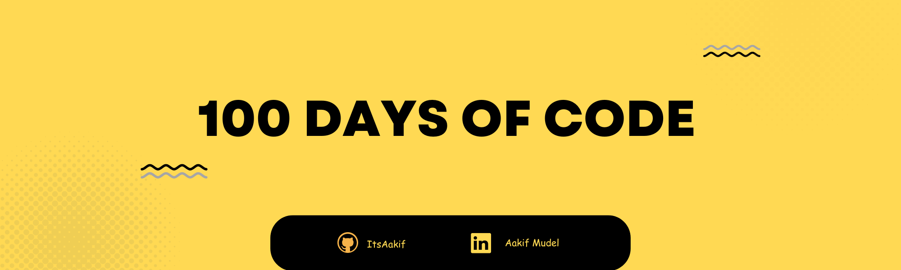

  <h1> 100 Days Of Code</h1>
  
  

Join the 100 Days of Code challenge and transform your coding skills. Commit to coding for at least an hour every day for 100 days. Access daily coding tasks, resources, and a supportive community. Start your coding journey today!

## What Is the "100 Days of Code" Challenge?

The **"100 Days of Code"** challenge is a transformative commitment to daily coding practice, skill enhancement, and personal growth. It's an opportunity to:

- 🚀 **Learn**: Explore a wide range of programming languages and technologies.
- 👨‍💻 **Build**: Create coding projects and expand your portfolio.
- 🧩 **Problem-Solving**: Tackle coding challenges and refine your problem-solving skills.
- 👥 **Connect**: Connect with others who have taken this challange and and gain insights.
- 📈 **Transform**: Witness your coding abilities soar as you make coding an integral part of your daily routine.

## What to Expect

In this documentation, you'll find a comprehensive guide to the "100 Days of Code" challenge. It includes:

- 📅 A detailed plan for each of the 100 days, breaking down coding tasks and projects.
- 📚 Resources and links to tutorials, documentation, and coding exercises to support your learning journey.
- 🗂️ Organization by programming languages, including HTML, CSS, JavaScript, Python, Java, and C++.
  

## Join the Challange

This documentation is designed to be your companion throughout the "100 Days of Code" challenge, regardless of your coding experience. Whether you're a beginner or an experienced coder, you're invited to explore, learn, and embark on this coding adventure.

👉 Start by checking out the [100 Days of Code Plan](plan.md) for a day-by-day breakdown of the entire challenge.

If you are taking the challange dont forget to make a post using #100DaysOfCode on your social media and tagging me
.

## My Socials are:

  
  
  

  
Let's code our way to success, one day at a time, and together, we'll unlock the incredible potential of daily coding practice!

# 100 Days of Code Plan

[Click to View Index >>](./Plan.md)
[Start with Day 1 >>](./Day_1-10/Day_1-10.md)
